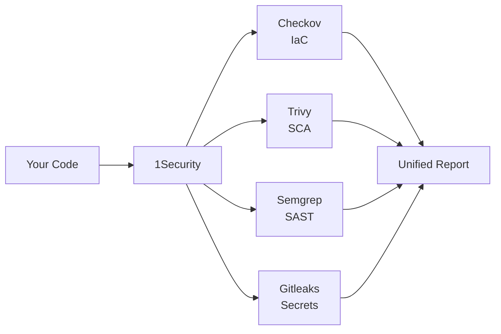

# 1Security — All-in-One Security Scanner


> **Stop juggling multiple security tools.** 1Security runs them all with one command.

**1Security** is an open-source security orchestrator that unifies the best security scanners into a single platform. One configuration file. One command. Complete security coverage.

---

## 🎯 What Does It Do?

1Security scans your code for **4 types of security issues**:

| 🔍 **What It Finds** | 🛠️ **Tool Used** | 📝 **Example** |
|---------------------|------------------|----------------|
| **Infrastructure misconfigurations** | Checkov | Unencrypted S3 buckets, open security groups |
| **Vulnerable dependencies** | Trivy | Outdated packages with known CVEs |
| **Code vulnerabilities** | Semgrep | SQL injection, XSS, hardcoded secrets |
| **Exposed secrets** | Gitleaks | API keys, passwords, tokens in code |

**Result**: One unified report in JSON, HTML, or SARIF format.

---

## ⚡ Quick Start (3 Steps)

### 1. Install

```bash
git clone https://github.com/jagan-raj-r/1Security.git
cd 1Security
pip install -e .
```

### 2. Set Up Tools

```bash
# Automatically installs all security scanners
1security setup
```

### 3. Scan

```bash
# Creates config and runs first scan
1security init
1security run

# View results
open reports/1security-report.html
```

**That's it!** 🎉 Your first security scan is complete.

---

## ✨ Key Features

### 🚀 **Simple & Fast**
- **One command** to scan everything
- **Automatic tool installation** (no manual setup!)
- **Smart caching** for faster subsequent scans

### 📊 **Beautiful Reports**
- **Interactive HTML** with filtering & search
- **JSON** for automation & CI/CD
- **SARIF** for GitHub Security integration

### 🎯 **Developer-Friendly**
- **YAML configuration** (easy to understand)
- **Clear output** with severity levels
- **CI/CD ready** (fail builds on issues)

### 🔧 **Flexible**
- **Choose your tools** (enable/disable any scanner)
- **Custom arguments** for each tool
- **Multiple output formats** (HTML, JSON, SARIF)

---

## 📖 How It Works



1. **Configure once**: Edit `config.yaml` to choose tools and settings
2. **Run anywhere**: Works on your laptop, in CI/CD, anywhere Python runs
3. **Get insights**: View findings in beautiful HTML reports with filtering

---

## 🔧 Usage Examples

### Basic Scan

```bash
# Scan current directory with default config
1security run
```

### Custom Configuration

```yaml
# config.yaml
project_name: "MyApp"

tools:
  iac:
    enabled: true
    runner: "checkov"
  
  sca:
    enabled: true
    runner: "trivy"
  
  sast:
    enabled: true
    runner: "semgrep"
    args: ["--config=auto"]
  
  secrets:
    enabled: true
    runner: "gitleaks"

output:
  format: "all"        # json, html, sarif, or all
  report_path: "reports"
  fail_on: "high"      # Fail if High+ issues found
```

```bash
# Run with custom config
1security run --config config.yaml
```

### CI/CD Integration

```bash
# Fail build if critical/high issues found
1security run --format sarif --fail-on high

# Exit code 0 = no issues above threshold
# Exit code 1 = issues found, build should fail
```

---

## 📚 Documentation

**Complete guides in the [`docs/`](docs/) folder:**

| 📖 Guide | ⏱️ Time | 🎯 For |
|---------|--------|--------|
| [**Getting Started**](docs/GETTING_STARTED.md) | 10 min | First-time setup |
| [**User Guide**](docs/USER_GUIDE.md) | 20 min | All commands & configs |
| [**Features**](docs/FEATURES.md) | 15 min | What 1Security can do |
| [**Tools**](docs/TOOLS.md) | 30 min | Deep dive on each scanner |
| [**Development**](docs/DEVELOPMENT.md) | 20 min | Contributing & architecture |

**Quick Links:**
- 🆕 New user? Start here: [Getting Started](docs/GETTING_STARTED.md)
- 💻 Need a command? Check: [User Guide](docs/USER_GUIDE.md#quick-command-reference)
- 🔍 Browse all docs: [Documentation Index](docs/README.md)

---

## 🛠️ Commands Reference

```bash
# Initialize new project (creates config.yaml)
1security init

# Check which tools are installed
1security check

# Install missing tools automatically
1security setup

# Run security scan
1security run [OPTIONS]

# Get help
1security --help
1security run --help
```

### Common Options

```bash
# Specify config file
1security run --config my-config.yaml

# Change output format
1security run --format json           # JSON only
1security run --format html           # HTML only
1security run --format sarif          # SARIF only
1security run --format all            # All formats

# Change output directory
1security run --output ./my-reports

# Skip tool check (faster, but assumes tools installed)
1security run --skip-tool-check
```

---

## 🔒 Supported Security Scanners

| Tool | Category | What It Scans | Install |
|------|----------|---------------|---------|
| [**Checkov**](https://www.checkov.io/) | IaC | Terraform, CloudFormation, Kubernetes, Dockerfiles | `pip install checkov` |
| [**Trivy**](https://trivy.dev/) | SCA | Dependencies (npm, pip, go, etc.) | `brew install trivy` |
| [**Semgrep**](https://semgrep.dev/) | SAST | Code (Python, JS, Java, Go, etc.) | `pip install semgrep` |
| [**Gitleaks**](https://github.com/gitleaks/gitleaks) | Secrets | Hardcoded credentials, API keys | `brew install gitleaks` |

**Or let 1Security install them:**
```bash
1security setup --yes
```

---

## 🎯 Use Cases

### 🏢 **For Teams**
- **Standardize security** across all projects
- **One config** shared in git
- **Consistent reports** everyone understands

### 🚀 **For CI/CD**
- **Fail builds** on security issues
- **SARIF format** for GitHub integration
- **Fast** with caching

### 👨‍💻 **For Developers**
- **Catch issues** before commit
- **Learn security** from clear descriptions
- **Fix quickly** with recommendations

---

## 🔄 Integration Examples

### GitHub Actions

```yaml
name: Security Scan
on: [push, pull_request]

jobs:
  security:
    runs-on: ubuntu-latest
    steps:
      - uses: actions/checkout@v3
      - uses: actions/setup-python@v4
        with:
          python-version: '3.10'
      
      - name: Install 1Security
        run: |
          pip install git+https://github.com/jagan-raj-r/1Security.git
          1security setup --yes
      
      - name: Run Security Scan
        run: 1security run --format sarif --fail-on high
      
      - name: Upload Results
        uses: github/codeql-action/upload-sarif@v2
        if: always()
        with:
          sarif_file: reports/1security-report.sarif
```

### GitLab CI

```yaml
security_scan:
  image: python:3.10
  script:
    - pip install git+https://github.com/jagan-raj-r/1Security.git
    - 1security setup --yes
    - 1security run --format json --fail-on high
  artifacts:
    reports:
      security: reports/1security-report.json
    paths:
      - reports/
```

---

## 🗺️ Roadmap

### ✅ Phase 1 & 2 (Complete)
- [x] Multi-tool orchestration
- [x] Unified reporting
- [x] Automatic tool installation
- [x] Interactive HTML reports
- [x] SARIF export

### 🚧 Phase 3 (Planned)
- [ ] Web dashboard
- [ ] Issue deduplication
- [ ] Policy engine
- [ ] Slack/Teams notifications
- [ ] Plugin system

---

## 💡 Why 1Security?

### Before 1Security 😫

```bash
# Run each tool separately
checkov -d . --output json > checkov.json
trivy fs . --format json > trivy.json
semgrep --config=auto --json > semgrep.json
gitleaks detect --report-format json --report-path gitleaks.json

# Parse different output formats
# Combine results manually
# Generate reports yourself
# Set up each tool in CI/CD separately
```

### With 1Security 😎

```bash
# One command does everything
1security run

# Unified report ready
open reports/1security-report.html
```

**Result**: 80% time saved, 100% better insights.

---

## 🤝 Contributing

We welcome contributions! Whether it's:

- 🐛 Bug fixes
- ✨ New features
- 📝 Documentation
- 🔧 New tool integrations

See [DEVELOPMENT.md](docs/DEVELOPMENT.md) for guidelines.

---

## 📄 License

MIT License - see [LICENSE](LICENSE) file for details.

---

## 🙏 Credits

Built with these amazing open-source tools:

- [**Checkov**](https://www.checkov.io/) by Bridgecrew
- [**Trivy**](https://aquasecurity.github.io/trivy/) by Aqua Security
- [**Semgrep**](https://semgrep.dev/) by Semgrep Inc.
- [**Gitleaks**](https://github.com/gitleaks/gitleaks) by Zachary Rice

---

## 🌟 Star History

If 1Security helps you, give it a ⭐ on GitHub!

---

<div align="center">

**Built with ❤️ by [R Jagan Raj](https://github.com/jagan-raj-r)**

[Documentation](docs/README.md) • [Getting Started](docs/GETTING_STARTED.md) • [Report Issues](https://github.com/jagan-raj-r/1Security/issues)

</div>
